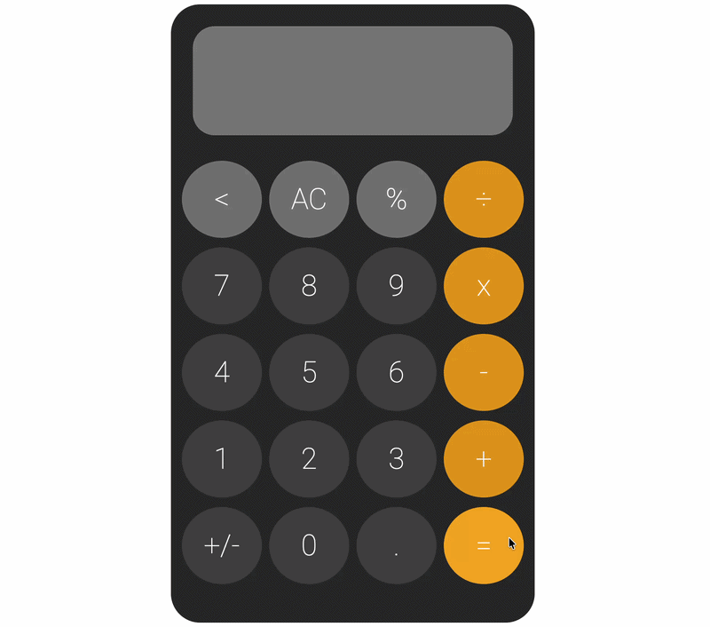

# Calculator Project
A Frontend Calculator allows the user to click numebers and make simple calculations.

## Live Demo
https://bizzyizzymax-bot.github.io/CalculatorProject/

## Features
- Buttons the user can click that will implement numbers and operators.
- A screen that will show the current numbers and operator.
- An system that will automatically make a calculation after an operator is used.
- A A/C button that will clear the screen and any numbers/operators entered.

## Tech Stack
- Html
- CSS
- Javascript

## What I learned
- How to use javascript arrays, variables, and functions
- How to implement the Document Object Model into javascript

## What I can improve
- I can make the calculator more advanced by adding a more advanced UI with animations.
- I can add more operators and functions to the calculator (ex. squared and square root)

